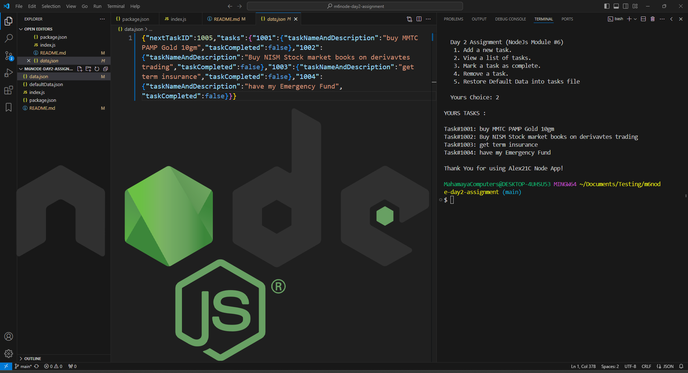

# Day 2 Assignment (Node Js Module #6 MERN Stack)


## Objectives
Using FS and path Module and readline Implement the following operations:
+ Add a new task.
+ View a list of tasks.
+ Mark a task as complete.
+ Remove a task.

## How to install and run in yours local machine
```bash
npm install
npm start
```

## Tech. Stack Used:
+ [NodeJS](https://nodejs.org/en/)

## Author
[Abhishek kumar](https://www.linkedin.com/in/alex21c/), ([Geekster](https://geekster.in/) MERN Stack FS-14 Batch)


